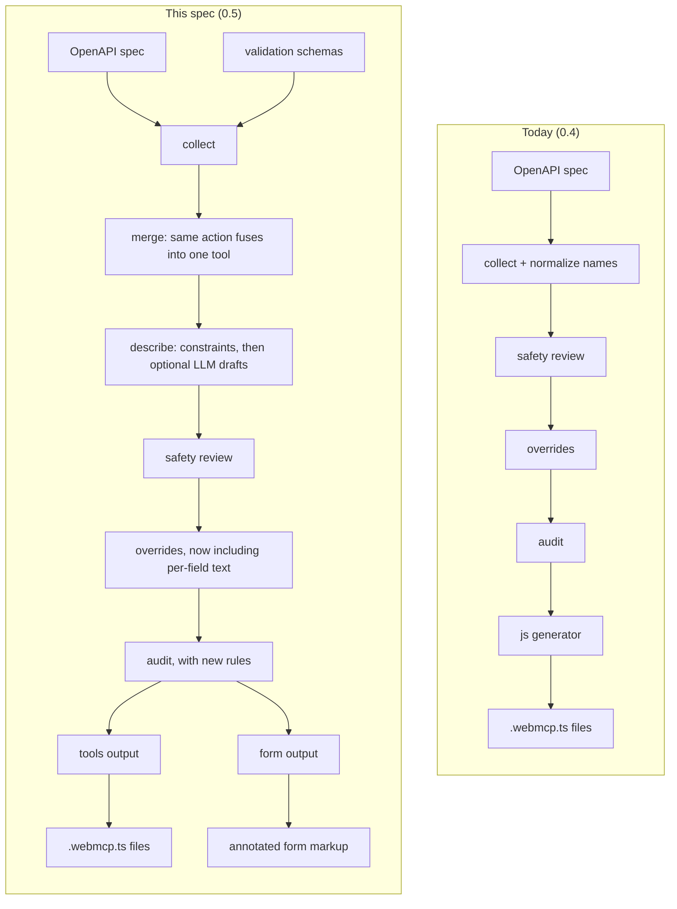
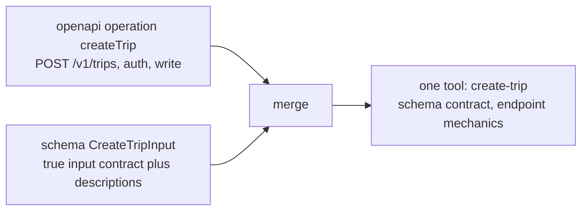

# The generation pipeline: sources, assembly, outputs

> The spec for the next version of the codegen pipeline, covering everything
> about producing tools: sources, the cross-source merge, description
> assembly, the LLM layer, outputs, and the 0.5 renames.
> Evidence and grounding: `docs/research/2026-09-03-what-a-tool-needs.md`,
> `docs/research/2026-09-03-beenthere-core-flow-agent-surface.md`.
> Journeys (multi-step tool sets with shared state) are a separate spec:
> `docs/specs/journeys.md`.
>
> Status: implemented on `feat/schema-source`; releases as `@webmcp-stack/codegen` 0.5.

**Read this in one pass.** The problem, the one rule, how it works on a real
app, then the details. Everything after "What changes for you" is reference.


## The problem

Today the codegen reads an OpenAPI spec and writes `.webmcp.ts` tool files.
Three gaps keep that from being enough:

**1. Many apps have no spec.** Most React/Next.js apps have route handlers,
server actions, and forms, but no OpenAPI document. Nothing to point the
codegen at.

**2. Sometimes the spec exists, but the endpoint is the wrong tool.**
beenthere has a great spec (73 operations). But an agent calling the raw
`create-trip` endpoint tool would bypass the app: no cover-photo upload, no
cache refresh, no navigation into the editor. The endpoint succeeds; the
product behavior doesn't. Chrome's own docs say tools should use the app's
existing capabilities, not replace them.

**3. Descriptions reach the agent as bare names.** Most specs and schemas
carry no field text, so the agent sees `minutes_worked: number`, guesses, and
fails validation. Chrome's examples put the constraint right in the prose:
"Minutes worked on this task. A number from 30 to 600."

All three are the same problem underneath: a good tool needs contract,
behavior, safety, and context, and no single source provides all of them.
This spec defines the pipeline that assembles them.


## The one rule: contracts, not codebases

Stated once, governing every source:

**Every source consumes a contract you already maintain. The codegen never
scans or infers application code.**

Markup and fetch calls are the least stable things in a repo, and every
heuristic miss becomes a silently wrong tool. Contracts are stable and
machine-readable by design:

| Source | Contract consumed | Answers | Status |
|---|---|---|---|
| `openapi` | OpenAPI 3.x spec | "what does the HTTP API expose" | shipped |
| `schema` | validation schemas (zod, valibot, arktype, TypeBox) | "what should an agent be able to do, in my product's terms" | this spec |
| `manual` | a small hand-written tools file | "just let me write it" | escape hatch |
| `trpc` | the router's own schemas | same as openapi, typed end to end | planned |

The sources are not alternatives and are never ranked. They answer different
questions about the same job, and one app can use several at once.

**Scope boundary, so it can't be misread:** you write the schema, in your
codebase, for your own reasons (it replaces hand-rolled `if (!title.trim())`
validation whether or not WebMCP is involved). The codegen only reads it and
produces tools. It never generates your app's validation logic.


## How it works (a real flow, end to end)

Three steps. The running example is beenthere's create-trip flow, which uses
both sources at once.

**Step 1: you write the schema (once, for your app).** This is app code, not
ours:

```ts
// packages/shared/src/schemas/trip.ts
import { z } from "zod";

export const CreateTripInput = z.object({
  title: z.string().min(1).max(40)
    .describe("Name of the trip, e.g. 'Kyoto in autumn'. 40 characters max."),
  startDate: z.string().optional()
    .describe("When the trip happened, e.g. '2026-03-14'. Optional."),
  locationObject: z.record(z.string(), z.unknown()).optional()
    .describe("Resolved place object. Always get this from the search-places tool; never invent it."),
});
```

**Step 2: you point the codegen at it.** One config entry per tool, explicit,
nothing scanned:

```js
// codegen.config.mjs
import { defineConfig } from "@webmcp-stack/codegen";
import { openapi, schema } from "@webmcp-stack/codegen/sources";
import { tools } from "@webmcp-stack/codegen/outputs";
import { CreateTripInput, SearchPlacesInput } from "./src/schemas";

export default defineConfig({
  sources: [
    openapi({ spec: "../server/openapi/openapi.json" }),
    schema({
      tools: [
        // operation: fuse with the spec's createTrip endpoint into one tool
        { name: "create-trip", schema: CreateTripInput, operation: "createTrip" },
        { name: "search-places", schema: SearchPlacesInput },
      ],
    }),
  ],
  outputs: [tools({ outDir: "./src/webmcp" })],
});
```

**Step 3: you run `generate`.**

```
$ npx @webmcp-stack/codegen generate

  found spec:     apps/server/openapi/openapi.json (73 operations)
  found schemas:  2 declared in codegen.config.mjs

  ✓ create-trip     merged: CreateTripInput + POST /v1/trips (write, confirm on)
  ✓ search-places   from schema (read, enabled)
  ✓ 70 tools        from openapi (49 read, 17 write, 4 destructive)
  ✖ 2 webhooks      skipped (they are for servers, not agents)
  ⚠ create-trip     field "locationObject" needs search-places; declare it or document the source
  ⚠ list-trips      no output schema; the agent gets unstructured text back
```

You get a `.webmcp.ts` per tool. The codegen owns the contract (name,
description, input schema, safety hints, confirmation gate). You own the
`execute()`: the scaffold is typed against your schema, and you can point it
at your app's own action layer instead of the raw endpoint, which is what
beenthere does so the cover upload, cache refresh, and editor navigation all
happen:

```ts
// src/webmcp/create-trip.webmcp.ts (your region, regeneration never touches it)
async execute(input: CreateTripInput) {
  const trip = await apiClient.createTrip({ id: crypto.randomUUID(), ...input });
  router.push(`/me/${trip.id}`);
  return toolResult(`Trip "${input.title}" created and opened in the editor.`);
}
```

**What the agent experience becomes:** "Create a trip for my Kyoto week" →
agent calls `search-places("Kyoto")`, then `create-trip`, you confirm (it's a
write), and the app does what it always does, ending with the editor open.


## The shape, before and after




## Under the hood

### The pipeline stages, in order

1. **Collect.** Each source produces `CandidateTool`s. A new source is a new
   collector, never a new pipeline.
2. **Merge.** A `schema` entry that names an OpenAPI operation fuses with it
   into one candidate. Declared by you, never guessed.
3. **Describe.** Field and tool descriptions are assembled in layers.
4. **Normalize names.** Version prefixes are stripped and collisions resolved,
   as today. Names you declared in a `schema` entry are used verbatim.
5. **Safety review.** Classification, hints, PII scan, endpoint roles.
   Unchanged.
6. **Overrides.** Your `.webmcp-codegen.json` edits win. Now per-field too.
7. **Audit.** Same semantics (errors block, warnings do not, `--force`
   overrides), plus new rules listed below.
8. **Outputs.** `tools` writes `.webmcp.ts` files; `form` annotates markup.

### The schema source

- **The config imports the schema as a value.** No parsing, no AST work. The
  schema arrives as an object and is converted to JSON Schema at generate
  time. How TypeScript schema modules load in the CLI is an open question
  (see the end).
- **Explicit, always.** No discovery of exported schemas. What you list is
  what becomes a tool.
- **Same pipeline.** Each entry becomes an ordinary candidate and flows
  through safety review and audit like any other.
- **Side effect defaults to write** for standalone schema entries (no HTTP
  verb to classify from), so confirmation is on unless the merge says
  otherwise. Name heuristics still apply (a schema tool named `sign-in` is
  treated as auth: generated, flagged, disabled).

### The merge: one action, one tool

When both sources describe the same action, you get one tool, not two. A
schema entry declares the OpenAPI operation it refines via `operation`, and
the two fuse before safety review:



Field by field, when merged:

| Field | Comes from | Why |
|---|---|---|
| `httpMethod`, `pathTemplate`, `serverUrl`, `paramLocations` | openapi | endpoint facts |
| `sideEffect`, `requiresAuth` | openapi | drives safety |
| `outputSchema` | openapi | the spec has response typing |
| `inputSchema`, `inputTypeName` | **schema** | your declared truth |
| `description` | **schema** | your words |

The one-line reasoning: the spec owns *what the endpoint is*, the schema owns
*what the action means*. The merged tool keeps both, and its scaffolded
`execute()` is typed against your schema, not the spec's parallel description.

Rules and failure modes:

- **`operation` that matches nothing is an error**, not a silent fallback. The
  report names it; you fix the name or drop `operation` to make the entry
  standalone.
- **A merged tool replaces the raw endpoint candidate.** The OpenAPI operation
  it fused with is consumed by the merge and does not also generate.
- **Accidental name collisions** (a schema tool and an unrelated endpoint with
  the same name) keep today's behavior: the later one is renamed and the audit
  says so.
- **`--dry-run` shows provenance.** A merged tool reports which parts came
  from which source, so review sees the fusion, not just the result.

A new audit rule this enables: when a tool's input is only producible by
another tool (a resolved place object, a server-assigned id), the declared set
must contain that producer. `create-trip` without `search-places` is a
warning: "field `locationObject` is not a value agents can invent; declare the
tool that produces it or document the source in its description."

### How descriptions get assembled

Agents pick tools by description and fill inputs from field text. Most sources
provide almost none, so the pipeline assembles both in five layers. Each layer
only fills what the layers above left empty, and your text always wins.

| Layer | What it provides | When it runs |
|---|---|---|
| 1. source text | spec summaries, `.describe()` text | always |
| 2. merge | schema contract text replaces thin spec text | when merged |
| 3. synthesis | constraint text rendered as prose | always, deterministic |
| 4. llm | drafted prose for fields still empty | opt-in only |
| 5. overrides | your per-tool and per-field text | always wins |

Layer 3, synthesis, renders JSON Schema constraints as plain language and
appends them to whatever text exists:

```
{ type: "number", minimum: 30, maximum: 600 }  →  "A number from 30 to 600."
```

It appends, never replaces; it skips constraints the text already states; and
it runs on every source because it works on the final merged `inputSchema`.
Fields with no text at all get a draft built from name + type + constraints,
marked as machine-written so the audit can see it (the same honesty rule as
`descriptionSource: "generated-template"`).

Layer 5 extends `.webmcp-codegen.json` from tool-level to field-level:

```json
{
  "tools": {
    "create-trip": {
      "description": "Create a trip and open it in the editor.",
      "fields": {
        "locationObject": "Resolved place from search-places. Never invent it."
      }
    }
  }
}
```

Overrides are the deterministic answer to "the generated text is not what I
want": say it once, it sticks across regenerations. The dev dashboard edits
these, so field descriptions become dashboard-editable too.

The audit reads only the **final assembled result**, never a single layer.
That is what keeps it honest: it judges what the agent will actually see.


## Outputs

Outputs are named after what lands in your repo.

| Output | What it produces | Status |
|---|---|---|
| `tools` | `.webmcp.ts` tool files (contract generated, `execute()` yours) | renamed from `js` |
| `form` | the four declarative attributes written into a literal `<form>` | this spec |
| `reactHooks` | hook-based registration | later |
| `manifest` | `/.well-known/webmcp.json` | later |

### The form lane (when a literal form exists)

Some surfaces really are `<form>` elements. For those, the `form` output
annotates the component in place instead of generating a file:

```diff
  <form action="/api/timesheets" method="post"
+   toolname="add-to-timesheet"
+   tooldescription="Report billing task and time to add to the timesheet.">
    <input name="minutes_worked" type="number" min="30" max="600"
+     toolparamdescription="Minutes worked on this task. A number from 30 to 600."
    />
```

The property no file output has: **the human is already in the loop.** The
agent fills the visible form, you review it, you press submit. Opt in per
tool with `form: "./src/components/ContactForm.tsx"` on the entry plus `form`
in `outputs`.

Rules, validated against a real React form (custom wrapper components, a
controlled input with no `name`, a button group posing as a field):

- Fields match by `name` or `id`; a matched field missing `name` gets one
  added (the declarative API addresses fields by name), reported as its own
  line.
- Custom wrapper components (a design-system `<Input>`) get the attributes on
  the JSX tag carrying the `id`/`name`. Whether they forward to the DOM is the
  component's contract; a wrapper that swallows attributes surfaces in the
  dashboard test run, not in a silent no-op.
- Non-form controls (button groups, custom pickers) get a report line naming
  the fix, never guessed attributes.
- No `<form>` element at the declared pointer is a clear error, not a guess.
  Many agent-worthy React surfaces have no form element at all (beenthere's
  core flow has zero); those use the `tools` output instead.
- Forms without `action`/`method` classify as write; submission still fires
  the component's existing `onSubmit`, because the browser's form machinery is
  what triggers React's handler.
- `toolautosubmit` is added to read forms (search/filter) and withheld from
  write forms, so a human always confirms a mutation. Per-tool override:
  `autosubmit: true`.
- Regeneration only fills absent attributes. Hand-edited values win, reported
  as kept. No merge markers in markup; the `--dry-run` diff is the review.
- Needs no registration wiring: the browser handles form-declared tools
  natively, so `wire.ts` is untouched by this output.


## Safety and audit

Unchanged in spirit and mechanics: classification, hints, PII scan, endpoint
roles, writes start disabled, errors block, `--force` overrides loudly. The
audit gains four rules, all facts about the assembled result:

| Rule | Level | Message says |
|---|---|---|
| Merge target missing | error | "schema entry names operation X, which is not in the spec" |
| Unproducible input | warning | "field Y is not a value agents can invent; declare its producer" |
| All fields undocumented after synthesis | warning | "constraints were synthesized; one line of prose per field is better" |
| Read tool with no `outputSchema` | warning | "the agent gets unstructured text back; add a response schema" |


## The LLM layer: advisory, always optional

Everything above works with no model, no key, no network: same input, same
output, same exit codes, in CI or offline. That deterministic core is not
negotiable; the audit is only trustworthy because it is reproducible.

For the judgments rules cannot make, an optional LLM layer exists with one
hard rule: **the model proposes, you dispose.** Nothing it produces reaches a
file, a description, or a classification without your review, and it never
changes exit codes.

It plugs in at exactly four points:

1. **Description drafting** (assembly layer 4): drafts prose only for fields
   still empty after layers 1-3. Never touches your text or synthesized text.
2. **Relationship suggestions**: extends the unproducible-input rule from
   declared structure to inference ("this looks producible by `search-places`,
   link them?"). Printed as suggestions, never findings.
3. **Semantic description review**: "the description says fetch a trip but the
   schema writes one." Advisory only.
4. **Tool-worthiness proposals** (`generate --suggest`): pointed at a schema
   module you name, proposes what is worth declaring. Never auto-declared.

It never classifies side effects or risk tiers, never writes files, never
blocks a run. No key configured means off, and the run is exactly the
deterministic one. Suggestions render apart from findings in the report
(`◦ llm suggestion` lines, only with the flag on).

The mechanism (provider config, your key, the overridable skill file, caching
by content hash, the dashboard accept/reject surface) is the one part left as
an open question. The boundary above is fixed regardless.


## What changes for you

There are no serious users yet, so this is the cheap moment for a breaking
rename. It stays cheap anyway: three mechanical renames.

**If you are new:** nothing about the first run changes. `npx
@webmcp-stack/codegen generate` still works with no config when a spec is
detectable, and CLI commands are unchanged (`generate` default, `init`,
`dev`), plus one flag: `generate --suggest` runs the LLM proposals. What is
new is that having no OpenAPI spec is no longer a dead end: `init` detects
zod/valibot/arktype/TypeBox in `package.json` and scaffolds a `schema` source block,
and when no spec is found it scaffolds the schema path instead of having
nothing to say.

**If you tried 0.4:** the rename table:

| 0.4 | 0.5 |
|---|---|
| `generate: [...]` | `outputs: [...]` |
| `from "@webmcp-stack/codegen/generators"` | `from "@webmcp-stack/codegen/outputs"` |
| `import { js }`, `js({...})` | `import { tools }`, `tools({...})` |

Your `.webmcp-codegen.json` keeps working unchanged (the new `fields` key is
optional). Your generated files keep working unchanged: same layout, same
marker contract, regeneration after upgrading produces the same files. The CLI
helps with the move: `loadConfig` recognizes the old `generate:` key and stops
with the exact three-line fix instead of a confusing type error. Hard error,
honest instructions, no silent dual support.

Version: 0.5.0 (0.x, so a minor carries the breaking change), with a changelog
entry showing the rename table.


## Reference

### What stays the same

Worth listing so review can confirm nothing quiet moved:

- Generated file layout and the marker split (generated region vs yours).
- Reads enabled, mutations generated disabled, auth/admin flagged and off.
- Webhooks skipped. Audit semantics: errors block, warnings do not.
- `.webmcp-codegen.json` as the home of your choices; dashboard edits it.
- Registration wiring for the `tools` output (`wire.ts` untouched).
- Zero runtime dependency: generated code belongs to you.
- The dev dashboard, the `--dry-run` review flow, `--force`.

### Implementation map

So this can be implemented in one pass, file by file against the current
codebase:

| File | Change |
|---|---|
| `src/types.ts` | `SourceKind` gains `"schema"`; `CandidateTool` gains `operationId?` and a merged-source ref shape; `CodegenConfig.generate` renamed `outputs`; `ToolOverrides` gains per-field `fields`; `ToolGenerator` renamed `Output` |
| `src/sources/schema.ts` | new: validation schema to `CandidateTool`; detects zod v3 vs v4 via the `~standard` marker, TypeBox via shape (it is already JSON Schema), and converts accordingly |
| `src/schema.ts` | rename to `src/json-schema.ts` so the JSON-Schema helpers do not share a name with the new source |
| `src/merge.ts` | new: fuses schema entries with their named operations before naming/safety; emits the missing-target error |
| `src/describe.ts` | new: `describeConstraints` plus the layer walk (source text, synthesis, LLM hook, overrides last) |
| `src/llm.ts` | new: provider interface, key handling, off-by-default; all four touchpoints behind it |
| `src/pipeline.ts` | insert merge and describe between collect and safety; pass field overrides through |
| `src/safety.ts` | the four new audit rules |
| `src/naming.ts` | declared schema names skip version-prefix stripping |
| `src/generators/` | renamed `src/outputs/`; `js.ts` becomes `tools.ts`; `form.ts` added (tag scanner, annotate-in-place, dry-run diff) |
| `src/config.ts` | accept `outputs`, hard-error on `generate` with the rename instructions |
| `src/detect.ts`, `src/setup.ts` | detect schema libraries in `package.json`; scaffold the schema path when no spec is found |
| `src/data-file.ts` | read/write per-field overrides |
| `src/cli.ts` | `--suggest` flag; report renders provenance and `◦` suggestion lines |
| `src/dev/` | dashboard edits field descriptions; shows merge provenance; LLM accept/reject surface |
| `package.json` | exports `/generators` replaced by `/outputs`; version 0.5.0 |
| README, docs site, `first-run-experience.md` | config examples updated when the code lands, not before |

### Open questions

- **Loading TypeScript schemas in the CLI.** Config files are plain `.mjs`
  loaded with a dynamic import, zero dependencies. Schema modules are often
  TypeScript. Options: Node native type stripping (needs recent Node; floor is
  20), a tiny loader like jiti (works everywhere, ends the zero-dependency
  streak), or requiring plain JS schema modules (friction). Leaning native
  stripping with the loader as fallback. Decide against a real Next.js app.
- **The LLM mechanism in detail.** Provider interface, BYOK, the shipped
  benchmarked skill file and its override path, caching by content hash, the
  dashboard accept/reject UI. The boundary is fixed above; this is plumbing.
- **Whether synthesis also enriches `outputSchema` text.** Leaning yes, since
  it runs on final schemas either way. Confirm at implementation.
- **Find + refine splitting.** The article splits large-collection search into
  `search` + `apply_filters` tools. The split is a design decision about your
  UI, not a mechanical transform, so generation does not do it. A future audit
  rule could *suggest* the split when an endpoint has many optional filter
  params. Trigger: real specs showing filter bloat.
- **Angular Signal Forms.** Chrome's own Angular support confirms
  schema-backed forms as the right contract. Demand decides.


## What success looks like

A developer with a Next.js app, with or without an OpenAPI spec, declares a
few schemas, runs `generate`, and gets contract-correct tools wired to the
app's own actions, with every field carrying text an agent can act on, the
audit catching the input no agent could have produced, and a human confirming
every write. Where a literal form exists, its attributes are written in place
and the human keeps the final click. Nobody parsed anybody's codebase, and
nothing in the run required a network call unless they asked for it.
